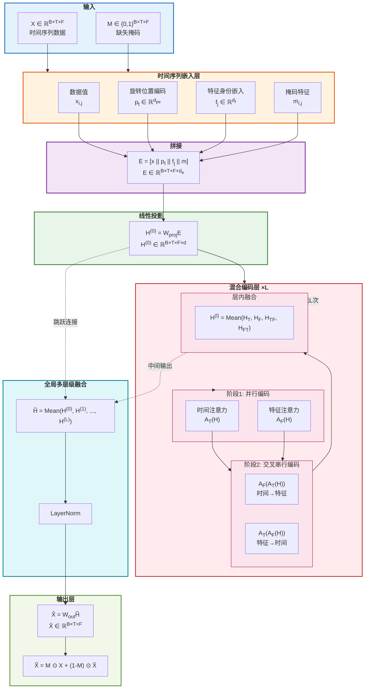
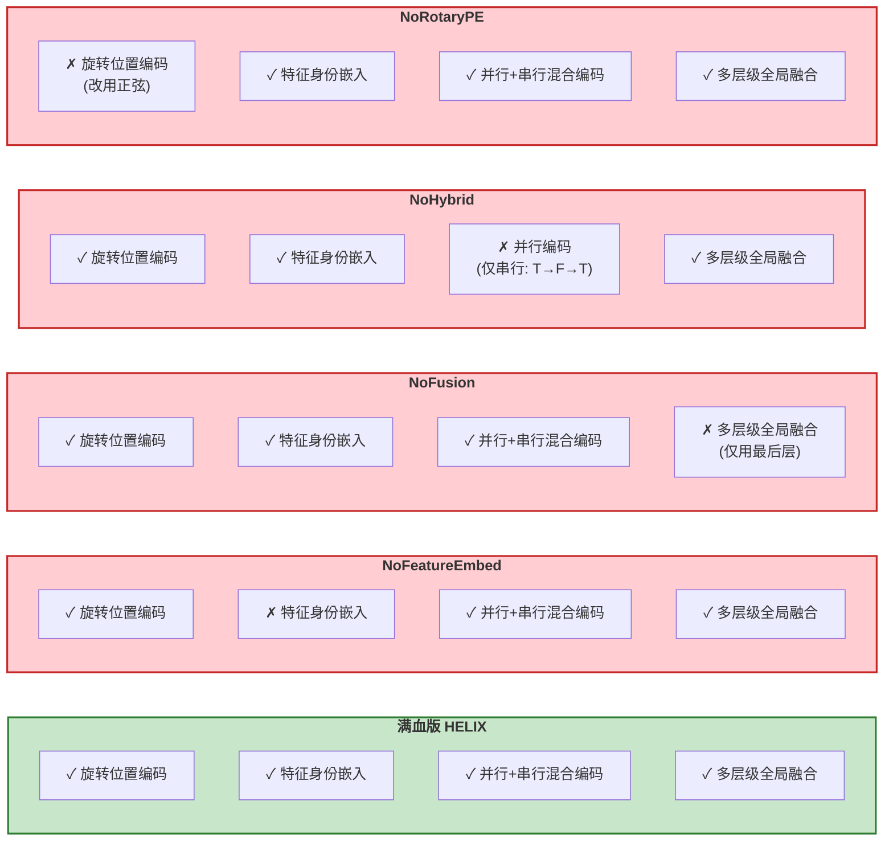

# HELIX: Hybrid Encoding with Learnable Identity and Cross-dimensional Synthesis for Time Series Imputation

## 完整架构规范文档

---

## 目录

1. [符号定义](#1-符号定义)
2. [满血版HELIX架构](#2-满血版helix架构)
   - 2.1 [整体架构概览](#21-整体架构概览)
   - 2.2 [旋转位置编码模块](#22-旋转位置编码模块-rotarypositionalencoding)
   - 2.3 [时间序列嵌入层](#23-时间序列嵌入层-timeseriesembedding2d)
   - 2.4 [特征投影模块](#24-特征投影模块-featureprojection)
   - 2.5 [统一注意力编码器](#25-统一注意力编码器-unifiedattentionencoder)
   - 2.6 [维度注意力模块](#26-维度注意力模块-dimensionalattention)
   - 2.7 [混合编码层](#27-混合编码层)
   - 2.8 [多层级融合机制](#28-多层级融合机制)
   - 2.9 [输出层与损失函数](#29-输出层与损失函数)
3. [消融版本架构](#3-消融版本架构)
   - 3.1 [HELIX_NoFeatureEmbed](#31-helix_nofeatureembed-移除特征身份嵌入)
   - 3.2 [HELIX_NoFusion](#32-helix_nofusion-移除多层级融合)
   - 3.3 [HELIX_NoHybrid](#33-helix_nohybrid-移除并行编码)
   - 3.4 [HELIX_NoRotaryPE](#34-helix_norotarype-替换为正弦位置编码)
4. [数据集与训练配置](#4-数据集与训练配置)
5. [架构流程图](#5-架构流程图)

---

## 1. 符号定义

| 符号 | 含义 | 典型值 |
|------|------|--------|
| $B$ | 批次大小 (Batch Size) | 32 |
| $T$ | 时间步数 (Time Steps) | 可变 |
| $F$ | 特征数量 (Features) | 可变 |
| $d_{pe}$ | 位置编码维度 | 16 |
| $d_f$ | 特征嵌入维度 | 1 |
| $d_e$ | 嵌入总维度 | $d_{pe} + d_f + 2$ |
| $d$ | 模型隐藏维度 | 256 |
| $H$ | 注意力头数 | 8 |
| $L$ | 编码层数 | 2 |
| $p$ | Dropout率 | 0.1 |

---

## 2. 满血版HELIX架构

### 2.1 整体架构概览

```
输入 → 嵌入层 → 线性投影 → [混合编码层 × L] → 全局融合 → 输出层 → 输出
```

**输入**:
- $X \in \mathbb{R}^{B \times T \times F}$: 时间序列数据（缺失值已填充为0）
- $M \in \{0, 1\}^{B \times T \times F}$: 缺失掩码（1表示观测值，0表示缺失值）

**输出**:
- $\tilde{X} \in \mathbb{R}^{B \times T \times F}$: 填补后的完整时间序列

---

### 2.2 旋转位置编码模块 (RotaryPositionalEncoding)

#### 2.2.1 初始化

**约束条件**: $d_{pe}$ 必须为偶数

**计算预存位置编码矩阵**:

对于位置 $t \in [0, max\_len)$ 和维度 $i \in [0, d_{pe}/2)$:

$$
div\_term_i = \exp\left( i \cdot \frac{-\ln(10000)}{d_{pe}} \right) = 10000^{-\frac{i}{d_{pe}}}
$$

$$
PE[t, 2i] = \sin(t \cdot div\_term_i)
$$

$$
PE[t, 2i+1] = \cos(t \cdot div\_term_i)
$$

最终得到位置编码矩阵 $PE \in \mathbb{R}^{max\_len \times d_{pe}}$

**存储方式**: 使用 `register_buffer` 注册为非训练参数

#### 2.2.2 前向传播

**输入**: 位置索引 $positions$（形状为 $[seq\_len]$ 或 $[batch, seq\_len]$）

**输出**: 对应的位置编码 $PE[positions]$

---

### 2.3 时间序列嵌入层 (TimeSeriesEmbedding2D)

#### 2.3.1 组件

1. **时间位置编码器**: `RotaryPositionalEncoding(d_model=d_{pe})`
2. **特征身份嵌入**: 可学习参数 $\mathbf{F}_{id} \in \mathbb{R}^{F \times d_f}$，初始化为标准正态分布 $\mathcal{N}(0, 1)$

#### 2.3.2 前向传播

**输入**:
- $X \in \mathbb{R}^{B \times T \times F}$
- $M \in \{0, 1\}^{B \times T \times F}$

**处理步骤**:

1. **数据值嵌入**: 
   $$V = X.\text{unsqueeze}(-1) \in \mathbb{R}^{B \times T \times F \times 1}$$

2. **时间位置编码**:
   - 生成位置索引: $pos = [0, 1, 2, ..., T-1]$
   - 获取编码: $P_t = PE[pos] \in \mathbb{R}^{T \times d_{pe}}$
   - 广播扩展: $P_t \rightarrow \mathbb{R}^{B \times T \times F \times d_{pe}}$
     ```
     P_t.unsqueeze(0).unsqueeze(2).expand(B, T, F, d_pe)
     ```

3. **特征身份嵌入**:
   - 广播扩展: $\mathbf{F}_{id} \rightarrow \mathbb{R}^{B \times T \times F \times d_f}$
     ```
     F_id.unsqueeze(0).unsqueeze(0).expand(B, T, F, d_f)
     ```

4. **掩码特征**:
   $$M_f = M.\text{unsqueeze}(-1) \in \mathbb{R}^{B \times T \times F \times 1}$$

5. **拼接**:
   $$E = \text{concat}[V, P_t, \mathbf{F}_{id}, M_f] \in \mathbb{R}^{B \times T \times F \times d_e}$$
   
   其中 $d_e = 1 + d_{pe} + d_f + 1 = d_{pe} + d_f + 2$

**输出**: $E \in \mathbb{R}^{B \times T \times F \times d_e}$

---

### 2.4 特征投影模块 (FeatureProjection)

#### 2.4.1 组件

1. **前向投影**: $W_{proj} \in \mathbb{R}^{d_e \times d}$（`nn.Linear(d_e, d)`）
2. **反向投影**: $W_{back} \in \mathbb{R}^{d \times d_e}$（`nn.Linear(d, d_e)`，本模型未使用）

#### 2.4.2 操作

**前向投影**:
$$H^{(0)} = E \cdot W_{proj}^T + b_{proj} \in \mathbb{R}^{B \times T \times F \times d}$$

---

### 2.5 统一注意力编码器 (UnifiedAttentionEncoder)

#### 2.5.1 架构

采用标准 **Post-LayerNorm Transformer Encoder** 结构:

```
输入 x
    ↓
MultiheadAttention(x, x, x) → attn_out
    ↓
Dropout(attn_out)
    ↓
x + Dropout(attn_out) → residual_1
    ↓
LayerNorm(residual_1) → x'
    ↓
FFN(x') → ffn_out
    ↓
Dropout(ffn_out)
    ↓
x' + Dropout(ffn_out) → residual_2
    ↓
LayerNorm(residual_2) → 输出
```

#### 2.5.2 组件详细配置

1. **多头自注意力**:
   ```python
   nn.MultiheadAttention(
       embed_dim=d,
       num_heads=H,
       dropout=p,
       batch_first=True
   )
   ```
   - `need_weights=False` 在前向传播中

2. **第一层归一化**: `nn.LayerNorm(d)`

3. **第一层Dropout**: `nn.Dropout(p)`

4. **前馈网络 (FFN)**:
   ```python
   nn.Sequential(
       nn.Linear(d, d * 4),    # 扩展4倍
       nn.ReLU(),              # 激活函数
       nn.Dropout(p),          # Dropout
       nn.Linear(d * 4, d)     # 压缩回原维度
   )
   ```

5. **第二层归一化**: `nn.LayerNorm(d)`

6. **第二层Dropout**: `nn.Dropout(p)`

#### 2.5.3 前向传播

**输入**: $x \in \mathbb{R}^{N \times S \times d}$（N为批次，S为序列长度）

**计算**:
```python
attn_out, _ = self.attn(x, x, x, need_weights=False)
x = self.norm1(x + self.dropout1(attn_out))
ffn_out = self.ffn(x)
x = self.norm2(x + self.dropout2(ffn_out))
```

**输出**: $x \in \mathbb{R}^{N \times S \times d}$

---

### 2.6 维度注意力模块 (DimensionalAttention)

#### 2.6.1 组件

内部包含一个 `UnifiedAttentionEncoder`

#### 2.6.2 前向传播

**输入**: 
- $x \in \mathbb{R}^{B \times T \times F \times d}$
- `target_dim`: 'time' 或 'feature'

**时间维度注意力** (`target_dim='time'`):

1. **重塑**: $[B, T, F, d] \xrightarrow{\text{permute}(0,2,1,3)} [B, F, T, d] \xrightarrow{\text{reshape}} [B \cdot F, T, d]$
2. **注意力**: 在 $T$ 维度上应用自注意力
3. **恢复**: $[B \cdot F, T, d] \xrightarrow{\text{reshape}} [B, F, T, d] \xrightarrow{\text{permute}(0,2,1,3)} [B, T, F, d]$

**特征维度注意力** (`target_dim='feature'`):

1. **重塑**: $[B, T, F, d] \xrightarrow{\text{reshape}} [B \cdot T, F, d]$
2. **注意力**: 在 $F$ 维度上应用自注意力
3. **恢复**: $[B \cdot T, F, d] \xrightarrow{\text{reshape}} [B, T, F, d]$

**输出**: $\mathbb{R}^{B \times T \times F \times d}$

---

### 2.7 混合编码层

每个混合编码层包含两个 `DimensionalAttention` 模块:
- `time`: 时间维度注意力
- `feature`: 特征维度注意力

#### 2.7.1 两阶段编码

**阶段1: 并行编码**

同时独立地在两个维度上进行注意力计算:

$$H_T = A_T(H^{(l-1)}) \quad \text{(时间注意力)}$$
$$H_F = A_F(H^{(l-1)}) \quad \text{(特征注意力)}$$

**阶段2: 交叉维度串行编码**

将阶段1的输出进行交叉处理:

$$H_{TF} = A_F(H_T) \quad \text{(先时间后特征)}$$
$$H_{FT} = A_T(H_F) \quad \text{(先特征后时间)}$$

#### 2.7.2 层内融合

对4个输出取均值:

$$H^{(l)} = \frac{1}{4}(H_T + H_F + H_{TF} + H_{FT})$$

---

### 2.8 多层级融合机制

#### 2.8.1 中间输出收集

在整个前向传播过程中，收集所有中间输出:

```python
all_outputs = [H^(0)]  # 初始投影后的输出

for l in range(L):
    # 每层添加4个输出
    all_outputs.extend([H_T, H_F, H_{TF}, H_{FT}])
```

**总输出数量**: $1 + 4L$（初始1个 + 每层4个）

#### 2.8.2 全局融合

对所有中间输出取均值:

$$\tilde{H} = \frac{1}{1 + 4L} \sum_{i=0}^{4L} H_i$$

#### 2.8.3 最终归一化

$$\tilde{H}_{norm} = \text{LayerNorm}(\tilde{H})$$

---

### 2.9 输出层与损失函数

#### 2.9.1 输出投影

**线性层**: `nn.Linear(d, 1)`

$$\hat{X} = W_{out} \cdot \tilde{H}_{norm} + b_{out}$$
$$\hat{X} = \hat{X}.\text{squeeze}(-1) \in \mathbb{R}^{B \times T \times F}$$

#### 2.9.2 最终输出

保留观测值，仅填补缺失值:

$$\tilde{X} = M \odot X + (1 - M) \odot \hat{X}$$

其中 $\odot$ 表示逐元素乘法

#### 2.9.3 训练损失

采用双任务训练策略:

**ORT损失 (Observed Reconstruction Task)**:

在观测位置上计算重建损失:
$$\mathcal{L}_{ORT} = \omega_{ORT} \cdot \text{Loss}(\hat{X}, X, M)$$

**MIT损失 (Masked Imputation Task)**:

在人工遮盖位置上计算填补损失:
$$\mathcal{L}_{MIT} = \omega_{MIT} \cdot \text{Loss}(\hat{X}, X_{ori}, M_{ind})$$

其中:
- $X_{ori}$: 原始完整数据
- $M_{ind}$: 指示掩码（标记人工遮盖的位置）
- $\omega_{ORT}, \omega_{MIT}$: 损失权重（默认均为1.0）
- Loss: 默认使用MAE

**总损失**:
$$\mathcal{L} = \mathcal{L}_{ORT} + \mathcal{L}_{MIT}$$

#### 2.9.4 验证指标

默认使用MSE在指示掩码位置计算:
$$\text{Metric} = \text{MSE}(\hat{X}, X_{ori}, M_{ind})$$

---

## 3. 消融版本架构

### 3.1 HELIX_NoFeatureEmbed (移除特征身份嵌入)

#### 3.1.1 修改点

**唯一改动**: 移除 `TimeSeriesEmbedding2D` 中的可学习特征身份嵌入

#### 3.1.2 嵌入层变化

**原版**:
```
E = concat[V, P_t, F_id, M_f]
d_e = 1 + d_pe + d_f + 1 = d_pe + d_f + 2
```

**消融版**:
```
E = concat[V, P_t, M_f]
d_e = 1 + d_pe + 1 = d_pe + 2
```

#### 3.1.3 详细实现

**TimeSeriesEmbedding2D (消融版)**:

```python
class TimeSeriesEmbedding2D(nn.Module):
    def __init__(self, n_features, pe_dim=16, feature_embed_dim=1):
        super().__init__()
        self.n_features = n_features
        self.pe_dim = pe_dim
        # feature_embed_dim 保留参数但不使用
        
        self.temporal_pe = RotaryPositionalEncoding(d_model=pe_dim)
        # 不创建 self.feature_id
    
    def forward(self, X, missing_mask):
        B, T, F = X.shape
        device = X.device
        
        # 数据值 [B, T, F, 1]
        data_val = X.unsqueeze(-1)
        
        # 时间位置编码 [B, T, F, pe_dim]
        pos_indices = torch.arange(T, device=device)
        temporal_encoding = self.temporal_pe(pos_indices)
        temporal_encoding = temporal_encoding.unsqueeze(0).unsqueeze(2)
        temporal_encoding = temporal_encoding.expand(B, T, F, self.pe_dim)
        
        # 【移除】特征身份嵌入
        
        # 掩码特征 [B, T, F, 1]
        mask_feature = missing_mask.unsqueeze(-1)
        
        # 拼接: 只有3个部分
        embedded = torch.cat([
            data_val,           # [B, T, F, 1]
            temporal_encoding,  # [B, T, F, pe_dim]
            mask_feature        # [B, T, F, 1]
        ], dim=-1)  # [B, T, F, pe_dim + 2]
        
        return embedded
```

**BackboneHELIX_NoFeatureEmbed**:

```python
# 嵌入维度计算变化
embed_dim = pe_dim + 2  # 原版: pe_dim + feature_embed_dim + 2
```

#### 3.1.4 其他组件

所有其他组件（混合编码、融合机制等）完全不变。

---

### 3.2 HELIX_NoFusion (移除多层级融合)

#### 3.2.1 修改点

**唯一改动**: 移除全局多层级融合，仅使用最后一层的输出

#### 3.2.2 详细变化

**原版前向传播**:
```python
all_outputs = [x]  # 收集初始输出

for layer in self.encoders:
    # ... 编码 ...
    all_outputs.extend([time_encoded, feat_encoded, time_feat, feat_time])
    x = mean([time_encoded, feat_encoded, time_feat, feat_time])  # 层内融合

# 全局融合
fused = mean(all_outputs)  # 对所有中间输出取均值
fused = self.final_norm(fused)
```

**消融版前向传播**:
```python
# 【不收集】中间输出

for layer in self.encoders:
    # ... 编码 ...
    # 【保留】层内融合
    x = mean([time_encoded, feat_encoded, time_feat, feat_time])

# 【不进行】全局融合，直接使用最后一层输出
fused = self.final_norm(x)
```

#### 3.2.3 完整BackboneHELIX_NoFusion.forward

```python
def forward(self, X, missing_mask):
    # 嵌入
    embedded = self.embedding(X, missing_mask)  # [B, T, F, embed_dim]
    
    # 投影
    x = self.projection.project_forward(embedded)  # [B, T, F, d_model]
    
    # 【消融】不存储中间输出
    
    # 多层混合编码
    for layer_encoders in self.encoders:
        # 阶段1: 并行编码
        time_encoded = layer_encoders['time'](x, 'time')
        feat_encoded = layer_encoders['feature'](x, 'feature')
        
        # 阶段2: 交叉串行编码
        time_feat = layer_encoders['feature'](time_encoded, 'feature')
        feat_time = layer_encoders['time'](feat_encoded, 'time')
        
        # 层内融合（保留）
        x = torch.stack([time_encoded, feat_encoded, time_feat, feat_time], dim=0).mean(dim=0)
    
    # 【消融】直接使用最后一层输出
    fused = self.final_norm(x)
    
    # 输出投影
    output = self.output_proj(fused).squeeze(-1)
    
    return output
```

#### 3.2.4 其他组件

嵌入层、注意力模块、损失函数等完全不变。

---

### 3.3 HELIX_NoHybrid (移除并行编码)

#### 3.3.1 修改点

**唯一改动**: 移除两阶段并行-串行混合编码，改为纯串行编码

#### 3.3.2 编码策略变化

**原版（混合编码）**:
```
阶段1（并行）:
  H_T = A_T(H)      H_F = A_F(H)
         ↓                ↓
阶段2（交叉串行）:
  H_TF = A_F(H_T)   H_FT = A_T(H_F)

融合: H = mean(H_T, H_F, H_TF, H_FT)
```

**消融版（纯串行）**:
```
H = A_T(H)    # 时间注意力
    ↓
H = A_F(H)    # 特征注意力
    ↓
H = A_T(H)    # 时间注意力
```

#### 3.3.3 完整BackboneHELIX_NoHybrid.forward

```python
def forward(self, X, missing_mask):
    # 嵌入
    embedded = self.embedding(X, missing_mask)
    
    # 投影
    x = self.projection.project_forward(embedded)
    
    # 存储中间输出（保留全局融合）
    all_outputs = [x]
    
    # 多层【纯串行】编码
    for layer_encoders in self.encoders:
        # 【消融】移除阶段1并行编码
        # 只使用串行: Time → Feature → Time
        
        # 步骤1: 时间注意力
        x = layer_encoders['time'](x, 'time')
        all_outputs.append(x)
        
        # 步骤2: 特征注意力
        x = layer_encoders['feature'](x, 'feature')
        all_outputs.append(x)
        
        # 步骤3: 时间注意力
        x = layer_encoders['time'](x, 'time')
        all_outputs.append(x)
    
    # 全局融合（保留）
    fused = torch.stack(all_outputs, dim=0).mean(dim=0)
    fused = self.final_norm(fused)
    
    # 输出投影
    output = self.output_proj(fused).squeeze(-1)
    
    return output
```

#### 3.3.4 中间输出数量变化

**原版**: $1 + 4L$（初始1个 + 每层4个）

**消融版**: $1 + 3L$（初始1个 + 每层3个）

#### 3.3.5 层内融合

**原版**: 对4个输出取均值

**消融版**: 无层内融合（串行传递）

#### 3.3.6 其他组件

嵌入层、注意力模块等完全不变。

---

### 3.4 HELIX_NoRotaryPE (替换为正弦位置编码)

#### 3.4.1 修改点

**唯一改动**: 将 `RotaryPositionalEncoding` 替换为 `SinusoidalPositionalEncoding`

#### 3.4.2 编码实现

**SinusoidalPositionalEncoding**:

```python
class SinusoidalPositionalEncoding(nn.Module):
    def __init__(self, d_model, max_len=5000):
        super().__init__()
        
        position = torch.arange(max_len).unsqueeze(1)
        div_term = torch.exp(torch.arange(0, d_model, 2) * (-math.log(10000.0) / d_model))
        pe = torch.zeros(max_len, d_model)
        pe[:, 0::2] = torch.sin(position * div_term)
        pe[:, 1::2] = torch.cos(position * div_term)
        
        self.register_buffer('pe', pe)
    
    def forward(self, positions):
        return self.pe[positions]
```

#### 3.4.3 TimeSeriesEmbedding2D 变化

```python
class TimeSeriesEmbedding2D(nn.Module):
    def __init__(self, n_features, pe_dim=16, feature_embed_dim=1):
        super().__init__()
        self.n_features = n_features
        self.pe_dim = pe_dim
        self.feature_embed_dim = feature_embed_dim
        
        # 【消融】使用正弦位置编码替代旋转位置编码
        self.temporal_pe = SinusoidalPositionalEncoding(d_model=pe_dim)
        
        # 特征身份嵌入（保留）
        self.feature_id = nn.Parameter(torch.randn(n_features, feature_embed_dim))
```

#### 3.4.4 技术说明

在当前实现中，`RotaryPositionalEncoding` 和 `SinusoidalPositionalEncoding` 的计算公式完全相同。这个消融实验的目的是验证位置编码组件的命名与概念区分。

**备注**: 真正的Rotary Position Embedding (RoPE) 通常通过旋转查询和键向量来实现，而非简单的加性位置编码。当前代码中的"Rotary"命名可能是概念性的区分。

#### 3.4.5 其他组件

混合编码、融合机制、损失函数等完全不变。

---

## 4. 数据集与训练配置

### 4.1 DatasetForHELIX

#### 4.1.1 参数

| 参数 | 类型 | 说明 |
|------|------|------|
| `data` | dict/str | 数据字典或文件路径 |
| `return_X_ori` | bool | 是否返回原始数据 |
| `return_y` | bool | 是否返回标签 |
| `file_type` | str | 文件类型，默认"hdf5" |
| `rate` | float | 人工缺失率，默认0.2 |

#### 4.1.2 数据处理流程

**训练时 (`return_X_ori=False`)**:
1. 获取原始数据 $X_{ori}$
2. 使用MCAR (Missing Completely At Random) 以概率 `rate` 人工添加缺失
3. 填充缺失值（填0）并生成缺失掩码 $M$
4. 计算指示掩码: $M_{ind} = M_{ori} - M$（标记人工缺失位置）

**验证/测试时 (`return_X_ori=True`)**:
1. 直接使用预处理好的 $X$, $X_{ori}$, $M$, $M_{ind}$

#### 4.1.3 输出格式

每个样本返回:
```python
[
    torch.tensor(idx),      # 样本索引
    X,                      # 带缺失的输入数据
    missing_mask,           # 缺失掩码
    X_ori,                  # 原始完整数据
    indicating_mask,        # 指示掩码
    y (可选)                # 标签
]
```

### 4.2 训练配置

#### 4.2.1 默认超参数

| 参数 | 默认值 | 说明 |
|------|--------|------|
| `pe_dim` | 16 | 位置编码维度 |
| `feature_embed_dim` | 1 | 特征嵌入维度 |
| `d_model` | 256 | 模型隐藏维度 |
| `n_heads` | 8 | 注意力头数 |
| `n_layers` | 2 | 编码层数 |
| `dropout` | 0.1 | Dropout率 |
| `ORT_weight` | 1.0 | ORT损失权重 |
| `MIT_weight` | 1.0 | MIT损失权重 |
| `batch_size` | 32 | 批次大小 |
| `epochs` | 100 | 训练轮数 |
| `lr` | 0.001 | 学习率 |
| `training_loss` | MAE | 训练损失函数 |
| `validation_metric` | MSE | 验证指标 |

#### 4.2.2 学习率调度

**可选配置**:
- `lr_decay_patience`: 学习率衰减耐心值（默认None，禁用）
- `min_lr`: 最小学习率（默认1e-6）

**调度器**: `ReduceLROnPlateau`
- `mode='min'`
- `factor=0.5`（每次衰减一半）
- 当验证损失不再改善时触发

#### 4.2.3 约束检查

```python
if d_model % n_heads != 0:
    d_model = n_heads * (d_model // n_heads)  # 自动调整
```

---

## 5. 架构流程图

### 5.1 满血版HELIX



### 5.2 消融版本对比图



### 5.3 各版本嵌入维度对比

| 版本 | 嵌入维度公式 | 默认值 (d_pe=16, d_f=1) |
|------|-------------|------------------------|
| **HELIX (满血)** | $1 + d_{pe} + d_f + 1$ | 19 |
| **NoFeatureEmbed** | $1 + d_{pe} + 1$ | 18 |
| **NoFusion** | $1 + d_{pe} + d_f + 1$ | 19 |
| **NoHybrid** | $1 + d_{pe} + d_f + 1$ | 19 |
| **NoRotaryPE** | $1 + d_{pe} + d_f + 1$ | 19 |

### 5.4 各版本中间输出数量对比

| 版本 | 每层输出数 | 总中间输出数 (L=2) |
|------|-----------|-------------------|
| **HELIX (满血)** | 4 | 1 + 4×2 = 9 |
| **NoFeatureEmbed** | 4 | 1 + 4×2 = 9 |
| **NoFusion** | 0 (不收集) | 1 (仅最后层) |
| **NoHybrid** | 3 | 1 + 3×2 = 7 |
| **NoRotaryPE** | 4 | 1 + 4×2 = 9 |

---

## 附录: 参数数量估算

设 $d_{pe}=16$, $d_f=1$, $d=256$, $H=8$, $L=2$, $F$ 为特征数

### 满血版HELIX

| 组件 | 参数数量 |
|------|----------|
| 位置编码 | 0 (固定) |
| 特征身份嵌入 | $F \times d_f$ |
| 投影层 | $d_e \times d + d$ |
| 每个注意力层 | $(4d^2 + 4d) + (4d + d) + (8d^2 + 5d)$ |
| 每个编码层 | $2 \times$ 注意力层参数 |
| 最终LayerNorm | $2d$ |
| 输出投影 | $d + 1$ |

**总参数**: $\approx L \times 2 \times (12d^2 + 9d) + d_e \times d + 3d + F \times d_f + 1$

---

**文档版本**: 1.0  
**最后更新**: 2024年  
**作者**: MiBah Cat