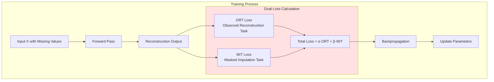

# HELIX Model Architecture

## Overall Architecture Flowchart

```mermaid
graph TB
    subgraph Input["Input Layer"]
        A[Input: X ∈ ℝ^(B×T×F)]
        B[Missing Mask ∈ ℝ^(B×T×F)]
    end
    
    subgraph Embedding["Embedding Module"]
        C[Data Value]
        D[Rotary Positional Encoding<br/>Temporal PE ∈ ℝ^(T×pe_dim)]
        E[Learnable Feature Identity<br/>Feature ID ∈ ℝ^(F×feat_dim)]
        F[Missing Indicator]
        G[Concatenate]
        H[Embedded ∈ ℝ^(B×T×F×embed_dim)]
    end
    
    subgraph Projection["Feature Projection"]
        I[Linear: embed_dim → d_model]
        J[X ∈ ℝ^(B×T×F×d_model)]
    end
    
    subgraph Layer1["Layer 1: Hybrid Encoding"]
        K1[Parallel Encoding]
        L1[Time Attention]
        M1[Feature Attention]
        N1[Serial Cross-Encoding]
        O1[Time→Feature]
        P1[Feature→Time]
        Q1[Intra-layer Fusion<br/>Average 4 outputs]
    end
    
    subgraph Layer2["Layer 2 to N: Hybrid Encoding"]
        K2[Parallel Encoding]
        L2[Time Attention]
        M2[Feature Attention]
        N2[Serial Cross-Encoding]
        O2[Time→Feature]
        P2[Feature→Time]
        Q2[Intra-layer Fusion]
    end
    
    subgraph Fusion["Global Multi-level Fusion"]
        R[Collect All Intermediate Outputs]
        S[Stack & Average All Outputs]
        T[Layer Normalization]
    end
    
    subgraph Output["Output Module"]
        U[Linear: d_model → 1]
        V[Reconstruction ∈ ℝ^(B×T×F)]
        W[Combine with Observations]
        X[Final Imputation ∈ ℝ^(B×T×F)]
    end
    
    A --> C
    A --> D
    A --> E
    B --> F
    C --> G
    D --> G
    E --> G
    F --> G
    G --> H
    H --> I
    I --> J
    
    J --> K1
    K1 --> L1
    K1 --> M1
    L1 --> N1
    M1 --> N1
    N1 --> O1
    N1 --> P1
    O1 --> Q1
    P1 --> Q1
    
    Q1 --> K2
    K2 --> L2
    K2 --> M2
    L2 --> N2
    M2 --> N2
    N2 --> O2
    N2 --> P2
    O2 --> Q2
    P2 --> Q2
    
    J --> R
    L1 --> R
    M1 --> R
    O1 --> R
    P1 --> R
    L2 --> R
    M2 --> R
    O2 --> R
    P2 --> R
    Q2 --> R
    
    R --> S
    S --> T
    T --> U
    U --> V
    V --> W
    B --> W
    A --> W
    W --> X
    
    style Input fill:#e1f5ff
    style Embedding fill:#fff4e1
    style Projection fill:#f0e1ff
    style Layer1 fill:#e1ffe1
    style Layer2 fill:#e1ffe1
    style Fusion fill:#ffe1e1
    style Output fill:#f5e1ff
```

## Detailed Component Architecture

```mermaid
graph LR
    subgraph Embedding["Embedding Components"]
        direction TB
        E1[1. Data Value<br/>shape: B×T×F×1]
        E2[2. Temporal PE<br/>Rotary Encoding<br/>shape: B×T×F×pe_dim]
        E3[3. Feature ID<br/>Learnable Embedding<br/>shape: B×T×F×feat_dim]
        E4[4. Missing Mask<br/>shape: B×T×F×1]
        E5[Total: pe_dim+feat_dim+2]
    end
    
    subgraph Attention["Attention Mechanism"]
        direction TB
        A1[Multi-head Self-Attention]
        A2[Feed-Forward Network]
        A3[Layer Norm + Residual]
    end
    
    subgraph Hybrid["Hybrid Encoding Strategy"]
        direction TB
        H1[Phase 1: Parallel]
        H2[Time Attention || Feature Attention]
        H3[Phase 2: Serial Cross]
        H4[Time→Feature & Feature→Time]
        H5[Fusion: Average 4 Paths]
    end
    
    E1 --> E5
    E2 --> E5
    E3 --> E5
    E4 --> E5
    
    A1 --> A3
    A2 --> A3
    
    H1 --> H2
    H2 --> H3
    H3 --> H4
    H4 --> H5
```

## Training Strategy: Dual Loss Functions



## Key Innovations Summary

1. **Hybrid Encoding Architecture**
   - Parallel encoding on both time and feature dimensions
   - Serial cross-dimensional encoding (Time→Feature & Feature→Time)
   - Multi-level fusion of all intermediate representations

2. **Advanced Positional Encoding**
   - Rotary Positional Encoding for temporal dimension
   - Learnable identity embeddings for feature dimension

3. **Multi-level Fusion Strategy**
   - Intra-layer fusion: Average of 4 encoding paths per layer
   - Global fusion: Average of all intermediate outputs across layers

4. **Dual Training Objectives**
   - ORT (Observed Reconstruction Task): Reconstruct observed values
   - MIT (Masked Imputation Task): Impute artificially masked values

## Mathematical Formulation

### Embedding Layer
```
Embedding(X, M) = [X; PE_temporal; ID_feature; M]
where:
  X ∈ ℝ^(B×T×F): Input data
  PE_temporal ∈ ℝ^(T×pe_dim): Rotary positional encoding
  ID_feature ∈ ℝ^(F×feat_dim): Learnable feature identity
  M ∈ ℝ^(B×T×F): Missing mask
```

### Hybrid Encoding Per Layer
```
// Phase 1: Parallel Encoding
H_time = Attention_time(X)
H_feat = Attention_feat(X)

// Phase 2: Serial Cross Encoding
H_time→feat = Attention_feat(H_time)
H_feat→time = Attention_time(H_feat)

// Intra-layer Fusion
X_next = Average(H_time, H_feat, H_time→feat, H_feat→time)
```

### Global Fusion
```
X_fused = Average(X_0, H_time^1, H_feat^1, ..., H_time^L, H_feat^L)
where L is the number of layers
```

### Dual Loss
```
L_total = α·L_ORT + β·L_MIT
where:
  L_ORT = Loss(Reconstruction, X_observed)
  L_MIT = Loss(Reconstruction, X_artificially_masked)
```